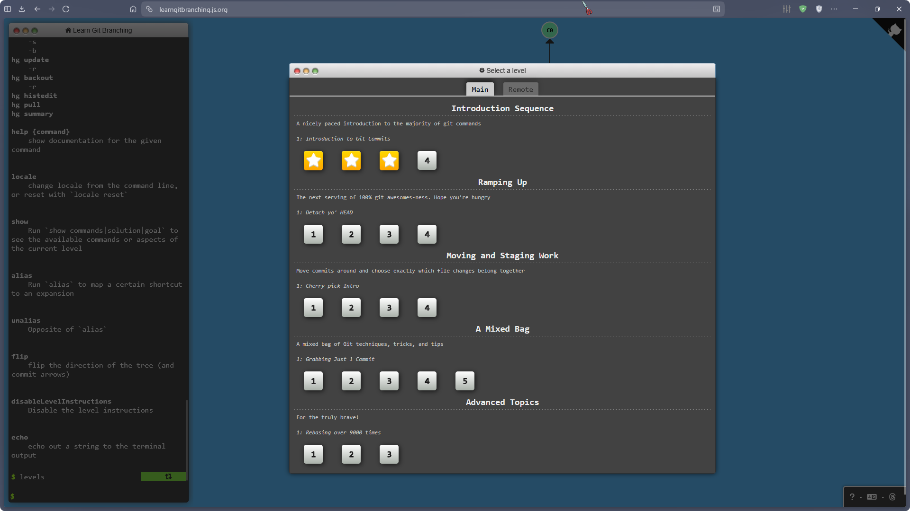

# Робота 3. Розмітка: README і сторінка про себе

Тема 3 · до **8 балів** · практика — друга пара й початок третьої ·
розбір і бали — з середини третьої пари

## Що має бути наприкінці

- `praktyka/03-rozmitka/peredbachennia.md` — **чотири передбачення** про Markdown:
  що ви очікували і що насправді показав перегляд;
- у головному `README.md` — ваш розділ **«Мої роботи»**: таблиця з робочими
  посиланнями на роботи 1–2, зображення, блок коду;
- `praktyka/03-rozmitka/about.html` — сторінка про себе **тільки на семантичних
  тегах**: жодного `<div>`, валідатор — **0 помилок**;
- `praktyka/03-rozmitka/tegy.md` — чому саме ці теги;
- усе на GitHub, посилання в чаті.

**Мінімум для зарахування** — кроки 0–2 і `about.html` без `div`
(хай навіть неповний).

**Контрольні точки:** 13:05 — крок 2 · 13:30 — крок 3 (кінець другої пари) ·
14:15 — крок 5, стоп і розбір.

Застрягли більше ніж на 5 хвилин — напишіть у чат номер кроку
й **скопійований** текст помилки.

> Робота 2 не доведена до `push`? Спершу її кроки 2–3 (репозиторій, клон,
> перший push) — без репозиторію цю роботу не здати. Решту роботи 2 — вдома.

> **Навчаєтесь асинхронно або не змогли бути на парі?** Ті самі кроки,
> дедлайн — до початку наступного заняття, посилання — у чат.
> Усне пояснення на розборі вам замінюють `peredbachennia.md` і `tegy.md`.

> **HTML і Markdown для вас не нові?** Кроки 0–5 — у своєму темпі,
> а потім одразу **⭐4** внизу: там справжня задача.

---

## Крок 0. Відкрити репозиторій (5 хв)

```
cd ~/smp-2026
git status
git pull --no-rebase --no-edit
code .
```

✔ `git status` — `nothing to commit, working tree clean`.
✔ `git pull` — `Already up to date.` або короткий список змін, якщо ви щось правили на сайті.

## Крок 1. Перегляд і чотири передбачення (15 хв)

Мова розмітки має правила, які не завжди збігаються з інтуїцією.
Перевірте, чи ви їх відчуваєте, **не підглядаючи у відповідь**.

**1.1.** Створіть `praktyka/03-rozmitka/chernetka.md` — це пісочниця.
Відкрийте її й натисніть `Ctrl+K`, потім `V`: праворуч зʼявиться перегляд
— так файл покаже GitHub.

**1.2.** Створіть `praktyka/03-rozmitka/peredbachennia.md` і **спершу** запишіть
туди відповіді на чотири питання — нічого ще не вставляючи в чернетку:

**Передбачення 1.** Два рядки без порожнього рядка між ними. Скільки рядків
покаже перегляд?

```
Перший рядок
Другий рядок
```

**Передбачення 2.** Які номери побачите в списку?

```
1. один
1. два
1. три
```

**Передбачення 3.** Чи буде слово жирним?

```
Це **жирний ** текст
```

**Передбачення 4.** Чи буде це таблицею?

```
| А | Б |
| 1 | 2 |
```

**1.3.** Тепер вставляйте фрагменти в `chernetka.md` по одному й дивіться
на перегляд. Під кожним передбаченням допишіть: **«Показав: … Я вгадав /
не вгадав, бо …»**. Не вгадати не страшно — бали за чесну перевірку.

```
git add praktyka/03-rozmitka/peredbachennia.md
git commit -m "Передбачення: правила Markdown"
```

(`chernetka.md` комітити не обовʼязково.)

## Крок 2. Розділ «Мої роботи» в README (25 хв)

Відкрийте головний `README.md` з переглядом (`Ctrl+K`, `V`). Одразу під рядком
`**Студент:** …` додайте свій розділ. Зразок нижче — **замініть текст своїм**;
у таблиці лишіть тільки ті файли, які у вас справді є.

````markdown
## Мої роботи

Коротко про себе: 1–2 речення, щось **жирним** і щось *курсивом*.

| № | Робота | Файл |
|---|---|---|
| 1 | Три предметні мови | [movy.md](praktyka/01-movy/movy.md) |
| 2 | Шпаргалка Git | [shpargalka.md](praktyka/02-git/shpargalka.md) |
| 2 | Розвʼязаний конфлікт | [pryvitannia.py](praktyka/02-git/pryvitannia.py) |
| 3 | Сторінка про мене | [about.html](praktyka/03-rozmitka/about.html) |


> Девіз або цитата — одним рядком.

Моя улюблена команда Git:

```bash
git log --oneline --graph
```
````

Посилання **відносні** — шлях від кореня репозиторію. На `about.html`
посилання поки не працюватиме — запрацює після кроку 3.
Немає скріншота тренажера — покладіть будь-яке своє зображення в
`praktyka/03-rozmitka/` і вкажіть шлях до нього.

```
git add README.md
git commit -m "README: розділ Мої роботи"
git push
```

✔ Відкрийте свій репозиторій на GitHub і **клацніть кожне посилання** в таблиці.
Відкривається файл — добре. 404 — див. «Якщо щось пішло не так».
✔ Зображення видно на сторінці репозиторію.

## Крок 3. Сторінка `about.html` (30 хв)

Створіть `praktyka/03-rozmitka/about.html` і вставте каркас:

```html
<!DOCTYPE html>
<html lang="uk">
<head>
  <meta charset="utf-8">
  <title>Про мене — Прізвище Імʼя</title>
</head>
<body>
  <header>
    <h1>Прізвище Імʼя</h1>
    <nav>
      <a href="#pro-mene">Про мене</a>
      <a href="#navchannia">Навчання</a>
      <a href="#plany">Плани</a>
    </nav>
  </header>

  <main>
    <section id="pro-mene">
      <h2>Про мене</h2>
      <p>…</p>
    </section>

    <section id="navchannia">
      <h2>Навчання</h2>
      <p>…</p>
    </section>

    <section id="plany">
      <h2>Плани</h2>
      <p>…</p>
    </section>
  </main>

  <footer>
    <p>Оновлено <time datetime="2026-09-21">21.09.2026</time></p>
  </footer>
</body>
</html>
```

Тепер заповніть і додайте — **спершу спробуйте самі**, підказки згорнуті:

1. У кожен `section` — абзац на 3–4 речення (разом 3–4 абзаци). Дату в `footer` — сьогоднішню.
2. В одну секцію — список із 3+ пунктів (наприклад, мови й інструменти, які знаєте).
3. Кілька важливих слів — виділені так, щоб читалка знала, що вони **важливі**, а не просто жирні.
4. У «Навчання» — скріншот тренажера **з підписом**, причому так, щоб браузер і читалка
   знали: підпис належить саме цій картинці. Шлях до картинки рахується від `about.html`.
5. У «Плани» — посилання на свій репозиторій.

<details>
<summary>Підказка: які теги</summary>

- список — `<ul>` і `<li>`;
- важливе — `<strong>` (а не `<b>`);
- посилання — `<a href="https://github.com/ВАШ-ЛОГІН/smp-2026">мій репозиторій</a>`;
- картинка з підписом:

```html
<figure>
  
  <figcaption>Перші кроки з Git, тема 2</figcaption>
</figure>
```

</details>

**Жодного `<div>`.** Для кожного блоку є тег, що каже, чим він є.

Відкрийте сторінку в браузері — подвійним клацанням у провіднику або з терміналу:

```
start praktyka/03-rozmitka/about.html
```

✔ Кирилиця читається, картинка видна, клацання в навігації прокручує до розділу.
✔ `Ctrl+F` у VS Code → `div` — **0 збігів**.

```
git add praktyka/03-rozmitka/about.html
git commit -m "Додано сторінку про себе на семантичних тегах"
git push
```

✔ **Кінець другої пари — ви тут.**

---

## Крок 4. Перевірка: дерево і валідатор (15 хв)

**4.1. Дерево.** У браузері на своїй сторінці натисніть `F12` → вкладка **Elements**.
Розгорніть `body`.

✔ Видно `header`, `main`, `footer`; у `main` — три `section`, у кожній — `h2`.

**4.2. Валідатор.** https://validator.w3.org/nu/ → **Check by: file upload** →
**Choose File** → ваш `about.html` → **Check**.

Виправте всі рядки **Error**. Рядки **Warning** можна лишити.
Після кожного виправлення — зберегти й перевірити ще раз.

✔ `Document checking completed. No errors or warnings to show.` — або лише warnings.

```
git add praktyka/03-rozmitka/about.html
git commit -m "about.html: виправлено помилки валідатора"
git push
```

(Якщо виправляти не було чого — коміт не потрібен.)

## Крок 5. Чому саме ці теги (10 хв)

Створіть `praktyka/03-rozmitka/tegy.md` — таблиця на **5 тегів** з вашого `about.html`:

```markdown
# Чому саме ці теги

| Тег | Що означає | Чому тут він, а не div |
|---|---|---|
| `nav` | … | … |
```

**Своїми словами** — у розборі спитаю саме це.

```
git add praktyka/03-rozmitka/tegy.md
git commit -m "Пояснення вибору тегів"
git push
```

Скиньте в чат посилання на свою сторінку:
`https://github.com/ВАШ-ЛОГІН/smp-2026/blob/master/praktyka/03-rozmitka/about.html`

---

## Якщо щось пішло не так

| Що бачите | Що це означає | Що робити |
|---|---|---|
| перегляд не відкривається | не та комбінація | `Ctrl+K`, відпустити, потім `V`; або `Ctrl+Shift+V` |
| посилання в README на GitHub — 404 | файл не запушено або шлях не той | `git status`; шлях від кореня репозиторію; великі й малі літери важливі |
| зображення в README не видно | не той шлях або пробіли в назві файлу | `praktyka/02-git/trenazher.png`; назви без пробілів |
| таблиця показується як текст | немає порожнього рядка перед таблицею або рядка з дефісами | додати порожній рядок і `\|---\|---\|` під заголовком |
| пів README стало «кодом» | не закрито блок коду | закрити трьома зворотними лапками |
| кирилиця в браузері — «кракозябри» | браузер не знає кодування | `<meta charset="utf-8">` у `<head>` |
| картинка в `about.html` не видна | шлях рахується від самого `about.html` | `../02-git/trenazher.png` |
| валідатор: `An img element must have an alt attribute` | немає опису картинки | дописати `alt="…"` |
| валідатор: `Stray end tag` | зайвий або не той закривальний тег | знайти рядок з номера в повідомленні, звірити пари тегів |
| `git pull` пише про конфлікт у README | README правили і на сайті, і локально | як у роботі 2: прибрати маркери → `git add` → `git commit` |
| `fatal: not a git repository` | ви не в теці репозиторію | `cd ~/smp-2026` |

---

## ⭐ Хто закінчив раніше

По черзі, скільки встигнете. Сходинки — від простої до справжньої задачі.

**⭐1. Послухати свою сторінку (15 хв).** Відкрийте `about.html` у браузері
й увімкніть Екранний диктор Windows: `Ctrl+Win+Enter`. Натискайте `H` —
диктор стрибатиме по заголовках. Потім у VS Code тимчасово замініть
один `<h2>…</h2>` на `<div>…</div>`, оновіть сторінку й знову натискайте `H`.
Вимкнути диктор — знову `Ctrl+Win+Enter`.
**Цю версію з `div` не комітьте** — поверніть `h2` (`Ctrl+Z`).
Допишіть у `tegy.md` одне речення: що змінилось на слух.

**⭐2. Справжній сайт (10 хв).** На GitHub у своєму репозиторії:
**Settings → Pages → Build and deployment → Source: Deploy from a branch →
Branch: `master`, `/ (root)` → Save**. Через 1–2 хвилини сторінка буде тут:
`https://ВАШ-ЛОГІН.github.io/smp-2026/praktyka/03-rozmitka/about.html` —
скиньте цю адресу в чат.

**⭐3. Та сама сторінка в Markdown (15 хв).** Створіть
`praktyka/03-rozmitka/about.md` з тим самим текстом. Порівняйте кількість
символів (`Ctrl+A` — число внизу VS Code). Допишіть в `about.md` два
речення: у скільки разів коротше і що з HTML-версії передати не вдалось.

**⭐4. Робот-перевіряльник для сторінки (30+ хв).** Справжня задача: зробіть так,
щоб GitHub **сам** перевіряв `about.html` на кожен push. Робили ⭐4 у роботі 2 —
допишіть кроки у свій `.github/workflows/perevirka.yml`; ні — створіть його.

На кожен push перевірка має:

1. падати, якщо в `praktyka/03-rozmitka/about.html` є хоч один `<div`;
2. відправляти `about.html` на валідатор W3C і падати, якщо у відповіді є хоч одна **помилка**
   (warnings — можна).

✔ Біля коміту на GitHub — **зелена галочка**; у вкладці **Actions** видно вивід валідатора.
✔ Навмисно закомітьте `<div>` у сторінку → **червоний хрестик**. Потім приберіть.

Довідка: [GitHub Actions — швидкий старт](https://docs.github.com/en/actions/writing-workflows/quickstart) ·
[API валідатора](https://github.com/validator/validator/wiki/Service-%C2%BB-Input-%C2%BB-POST-body).

<details>
<summary>Підказки</summary>

- Валідатор приймає файл POST-запитом:
  `curl -s -H "Content-Type: text/html; charset=utf-8" --data-binary @шлях/до/файлу "https://validator.w3.org/nu/?out=gnu"`
  — кожна помилка у відповіді містить `: error:`.
- Результат команди можна зберегти в змінну: `out=$(curl …)`, і показати в лозі: `echo "$out"`.
- `!` перед командою інвертує результат; така команда має бути **останньою** в кроці `run` — інакше її результат не врахується.
- Не шукайте в `$out` через `echo "$out" | grep …` разом з `!` — пайп може «проковтнути» помилку; надійніше `grep -q ': error:' <<< "$out"`.
- У YAML значення, що починається з `!`, беріть у лапки; багаторядковий крок — `run: |`.

</details>

---

## Критерії — до 8 балів

| Балів | За що |
|:---:|---|
| 3 | Видимий слід: README з «Моїми роботами» і `about.html` на GitHub, посилання в чаті |
| 3 | По суті: передбачення записані й перевірені; у README 5+ конструкцій і робочі посилання; в `about.html` немає `div`, валідатор — 0 помилок |
| 2 | Пояснюєте: чому саме ці теги — `tegy.md` і відповідь у розборі (асинхронно — письмово) |

Зробили на парі — домашнього немає. Не були або не встигли —
ті самі кроки вдома до наступного заняття, посилання в чат.
